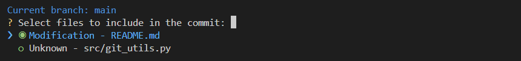
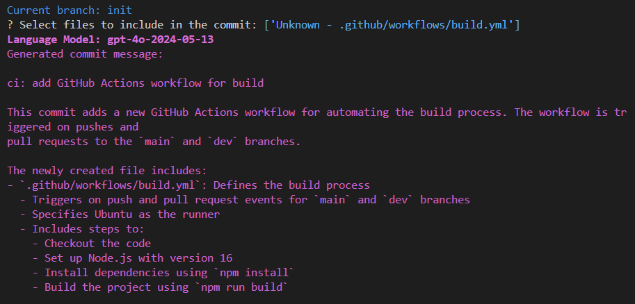

# AI Diff Commit

Automates the creation of standardized Git commit messages using [OpenAI's API](https://platform.openai.com/docs/), ensuring adherence to the [Conventional Commits specification](https://www.conventionalcommits.org/en/v1.0.0/) for clear and meaningful commit history.


## Features

- **Automated Commit Messages**: Generate standardized commit messages based on the changes in your repository.
- **Conventional Commits**: Ensure that your commit messages adhere to the Conventional Commits specification.
- **Customizable Commit Messages**: Modify the generated commit message to suit your needs before committing the changes.
- **Automated Git Operations**: Automatically add, commit, and push the changes to your repository.

## Limitations

- **OpenAI API Key**: Requires an API key from OpenAI to access the GPT-3 model for generating commit messages.
- **Internet Connection**: Requires an active internet connection to communicate with the OpenAI API.
- **Always Adds All Changes**: Adds all changes in the repository to the commit, which may not be suitable for all scenarios.
- **Requires a Git Repository**: Needs to be run in a Git repository to access the changes for generating commit messages.
- **Windows Installation**: The installation script is currently designed for Windows systems.

## Dependencies

- [**Colorama**](https://pypi.org/project/colorama/): For colored output in the terminal.
- [**OpenAI**](https://pypi.org/project/openai/): For interacting with the OpenAI API.
- [**InquirerPy**](https://pypi.org/project/InquirerPy/): For interactive command-line user interfaces.

## Installation Instructions (Windows)

I have only tested this on Windows, but it should work on other operating systems with minor modifications. For now, I will provide instructions for setting up the script on Windows that worked for me.

1. Clone the repository and navigate to the project directory.
2. Run the installation script using the following command:
    ```bash
    python install.py
    ```
   This script will:
   - Install the required dependencies.
   - Prompt you to enter your OpenAI API key and set it as an environment variable.
   - Move the repository contents to `C:\Scripts\ai_diff_commit`.
   - Add the `C:\Scripts` directory to your system's PATH environment variable.
   - Create a `ai_diff_commit.bat` file in the `C:\Scripts` directory to run the script from any location.


## Usage Instructions (Windows)

Once you have set up the script using the installation instructions, you can use the `ai_diff_commit` command to generate commit messages based on the changes in your repository.

### Flags

- `-a`, `--all`: Add all changes in the repository to the commit. By default, only the modified files are added.
- `-h`, `--help`: Display help information for the script.
- `-m`, `--model`: Specify the OpenAI API language model to use for generating commit messages.
- `-p`, `--push`: Automatically push the changes to the remote repository after committing.

For example, to generate a commit message based on all changes in the repository and push the changes to the remote repository, you can use the following command:

```bash
ai_diff_commit -a -p
```

## File Selection

The script will prompt you to select the files you want to include in the commit. You can use the arrow keys to navigate the list and the spacebar to select or deselect files. Press `Enter` to proceed with the selected files.



## Example Output

